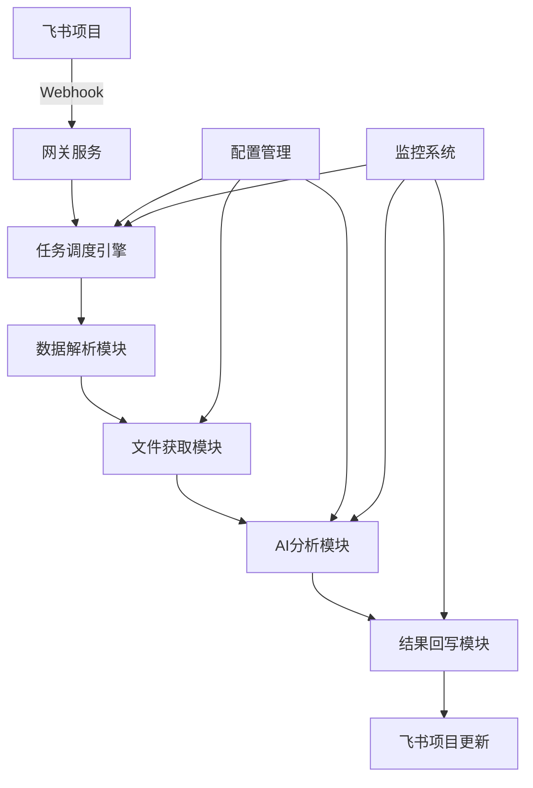

# AI综合分析管理平台

一个基于AI的自动化分析平台，通过Webhook接收飞书项目事件，自动获取文件内容，使用AI模型进行分析，并将结果回写到飞书项目中。

## 🚀 项目特性

- **🔗 通用集成能力**：支持Webhook方式接收多种系统事件
- **📁 多协议文件获取**：支持SMB、NFS、FTP、HTTP等多种文件协议
- **🤖 灵活AI分析**：支持多种AI模型（OpenAI、Moonshot、智谱等）
- **🔄 自动化流程**：完整的事件接收→文件获取→AI分析→结果回写流程
- **📊 监控分析**：详细的执行日志、Token消耗统计和性能监控
- **🛡️ 安全可靠**：敏感信息加密存储、请求验证、错误重试机制

## 🏗️ 系统架构



## 🛠️ 技术栈

### 后端
- **Python 3.11+** - 主要开发语言
- **FastAPI** - 高性能Web框架
- **SQLAlchemy** - ORM框架
- **PostgreSQL** - 主数据库
- **Redis** - 缓存和消息队列
- **Celery** - 异步任务处理
- **Alembic** - 数据库迁移

### 前端
- **Vue.js 3** - 前端框架
- **TypeScript** - 类型安全
- **Element Plus** - UI组件库
- **Pinia** - 状态管理
- **Vite** - 构建工具

### 部署
- **Docker** - 容器化
- **Docker Compose** - 服务编排
- **Nginx** - 反向代理
- **Prometheus + Grafana** - 监控（可选）

## 📋 系统要求

### 最低要求
- **CPU**: 2核心
- **内存**: 4GB RAM
- **存储**: 20GB 可用空间
- **操作系统**: Linux/Windows/macOS
- **Docker**: 20.10+
- **Docker Compose**: 2.0+

### 推荐配置
- **CPU**: 4核心或更多
- **内存**: 8GB RAM或更多
- **存储**: 50GB SSD
- **网络**: 稳定的互联网连接

## 🚀 快速开始

### 1. 克隆项目

```bash
git clone https://github.com/your-org/ai-analysis-platform.git
cd ai-analysis-platform
```

### 2. 配置环境变量

```bash
# 复制环境变量模板
cp .env.example .env

# 编辑配置文件
nano .env
```

**重要配置项**：
```bash
# 必须修改的配置
SECRET_KEY=your_very_secret_key_here_change_in_production
ENCRYPTION_KEY=your_encryption_key_32_chars_long
POSTGRES_PASSWORD=your_secure_postgres_password
REDIS_PASSWORD=your_redis_password
WEBHOOK_BASE_URL=https://your-domain.com/api/v1/webhooks
```

### 3. 启动服务

#### 开发环境
```bash
# 启动开发环境（包含热重载）
docker-compose -f docker-compose.dev.yml up -d

# 查看服务状态
docker-compose -f docker-compose.dev.yml ps

# 查看日志
docker-compose -f docker-compose.dev.yml logs -f
```

#### 生产环境
```bash
# 启动生产环境
docker-compose up -d

# 查看服务状态
docker-compose ps
```

### 4. 访问应用

- **前端应用**: http://localhost:3000 (开发) / http://localhost (生产)
- **后端API**: http://localhost:8000
- **API文档**: http://localhost:8000/docs
- **Celery监控**: http://localhost:5555

### 5. 初始化数据

```bash
# 创建管理员用户（如果需要）
docker-compose exec backend python -m app.scripts.create_admin

# 导入示例配置（可选）
docker-compose exec backend python -m app.scripts.import_examples
```

## 📖 使用指南

### 1. 配置AI模型

1. 登录管理界面
2. 进入「配置管理」→「AI模型配置」
3. 点击「添加模型」
4. 填写模型信息：
   - 模型名称：如 "GPT-4o"
   - 模型类型：选择对应类型
   - API端点：模型API地址
   - API密钥：模型访问密钥
   - 默认参数：JSON格式的模型参数

### 2. 配置存储凭证

1. 进入「配置管理」→「存储凭证配置」
2. 点击「添加凭证」
3. 填写存储信息：
   - 配置名称：如 "公司NAS"
   - 服务器地址：如 "smb://192.168.1.100/shared"
   - 协议类型：选择对应协议
   - 用户名和密码：访问凭证

### 3. 创建Webhook

1. 进入「Webhook管理」
2. 点击「发布新Webhook」
3. 填写Webhook信息：
   - 名称：如 "飞书美术审核触发器"
   - 描述：Webhook用途说明
4. 复制生成的Webhook URL到飞书项目中

### 4. 创建分析任务

1. 进入「任务管理」→「创建任务」
2. 按向导步骤配置：
   - **基本信息**：任务名称和描述
   - **触发器配置**：选择关联的Webhook
   - **数据解析配置**：配置JSONPath提取规则
   - **文件获取配置**：选择存储凭证
   - **AI分析配置**：选择模型和编写Prompt
   - **结果回写配置**：配置飞书API和字段映射

### 5. 监控任务执行

1. 进入「任务管理」查看任务列表
2. 点击「执行历史」查看详细日志
3. 进入「监控分析」查看统计数据

## 🔧 开发指南

### 开发环境设置

```bash
# 启动开发环境（包含开发工具）
docker-compose -f docker-compose.dev.yml --profile tools up -d

# 访问开发工具
# PgAdmin: http://localhost:5050
# Redis Commander: http://localhost:8081
# MailHog: http://localhost:8025
```

### 后端开发

```bash
# 进入后端容器
docker-compose -f docker-compose.dev.yml exec backend-dev bash

# 运行测试
pytest

# 代码格式化
black app/
flake8 app/

# 数据库迁移
alembic revision --autogenerate -m "描述"
alembic upgrade head
```

### 前端开发

```bash
# 进入前端容器
docker-compose -f docker-compose.dev.yml exec frontend-dev sh

# 运行测试
npm run test

# 代码检查
npm run lint
npm run type-check

# 构建生产版本
npm run build
```

### API文档

- **Swagger UI**: http://localhost:8000/docs
- **ReDoc**: http://localhost:8000/redoc
- **OpenAPI JSON**: http://localhost:8000/openapi.json

## 🚀 部署指南

### 生产环境部署

1. **准备服务器**
   ```bash
   # 安装Docker和Docker Compose
   curl -fsSL https://get.docker.com -o get-docker.sh
   sh get-docker.sh
   
   # 安装Docker Compose
   sudo curl -L "https://github.com/docker/compose/releases/download/v2.20.0/docker-compose-$(uname -s)-$(uname -m)" -o /usr/local/bin/docker-compose
   sudo chmod +x /usr/local/bin/docker-compose
   ```

2. **配置环境**
   ```bash
   # 克隆代码
   git clone https://github.com/your-org/ai-analysis-platform.git
   cd ai-analysis-platform
   
   # 配置环境变量
   cp .env.example .env
   nano .env  # 修改生产环境配置
   ```

3. **启动服务**
   ```bash
   # 构建并启动
   docker-compose up -d
   
   # 检查服务状态
   docker-compose ps
   docker-compose logs -f
   ```

4. **配置反向代理**（推荐使用Nginx）
   ```bash
   # 启动Nginx服务
   docker-compose --profile nginx up -d
   ```

5. **配置SSL证书**
   ```bash
   # 使用Let's Encrypt
   sudo apt install certbot python3-certbot-nginx
   sudo certbot --nginx -d your-domain.com
   ```

### 监控部署（可选）

```bash
# 启动监控服务
docker-compose --profile monitoring up -d

# 访问监控界面
# Prometheus: http://localhost:9090
# Grafana: http://localhost:3000
```

## 🔒 安全配置

### 1. 基础安全

- ✅ 更改所有默认密码
- ✅ 使用强密钥和密码
- ✅ 启用HTTPS
- ✅ 配置防火墙
- ✅ 限制数据库访问

### 2. 应用安全

- ✅ 敏感信息加密存储
- ✅ API请求验证
- ✅ CORS配置
- ✅ 速率限制
- ✅ 输入验证和清理

### 3. 运维安全

- ✅ 定期备份数据
- ✅ 监控异常访问
- ✅ 日志审计
- ✅ 定期更新依赖
- ✅ 安全扫描

## 📊 监控和维护

### 健康检查

```bash
# 检查所有服务状态
docker-compose ps

# 检查应用健康状态
curl http://localhost:8000/health

# 查看资源使用情况
docker stats
```

### 日志管理

```bash
# 查看应用日志
docker-compose logs -f backend
docker-compose logs -f celery-worker

# 查看错误日志
docker-compose logs --tail=100 backend | grep ERROR

# 清理旧日志
docker system prune -f
```

### 数据备份

```bash
# 备份数据库
docker-compose exec postgres pg_dump -U postgres ai_analysis_platform > backup_$(date +%Y%m%d).sql

# 恢复数据库
docker-compose exec -T postgres psql -U postgres ai_analysis_platform < backup_20231201.sql

# 备份Redis数据
docker-compose exec redis redis-cli BGSAVE
```

### 性能优化

```bash
# 数据库优化
docker-compose exec postgres psql -U postgres -d ai_analysis_platform -c "VACUUM ANALYZE;"

# 清理过期数据
docker-compose exec backend python -m app.scripts.cleanup_old_data

# 监控慢查询
docker-compose exec postgres psql -U postgres -d ai_analysis_platform -c "SELECT * FROM pg_stat_statements ORDER BY total_time DESC LIMIT 10;"
```

## 🐛 故障排除

### 常见问题

1. **服务启动失败**
   ```bash
   # 检查端口占用
   netstat -tulpn | grep :8000
   
   # 检查磁盘空间
   df -h
   
   # 查看详细错误
   docker-compose logs backend
   ```

2. **数据库连接失败**
   ```bash
   # 检查数据库状态
   docker-compose exec postgres pg_isready
   
   # 检查连接配置
   docker-compose exec backend env | grep DATABASE
   ```

3. **AI模型调用失败**
   ```bash
   # 检查网络连接
   docker-compose exec backend curl -I https://api.openai.com
   
   # 检查API密钥配置
   docker-compose exec backend python -c "from app.core.config import settings; print('API配置正常')"
   ```

4. **文件获取失败**
   ```bash
   # 测试网络连接
   docker-compose exec backend ping your-nas-server
   
   # 检查存储凭证
   docker-compose logs backend | grep "storage"
   ```

### 获取帮助

- 📖 查看详细文档：`./docs/`
- 🐛 提交Issue：[GitHub Issues](https://github.com/your-org/ai-analysis-platform/issues)
- 💬 技术讨论：[Discussions](https://github.com/your-org/ai-analysis-platform/discussions)
- 📧 联系邮箱：support@your-domain.com

## 🤝 贡献指南

我们欢迎所有形式的贡献！请查看 [CONTRIBUTING.md](./CONTRIBUTING.md) 了解详细信息。

### 开发流程

1. Fork 项目
2. 创建功能分支 (`git checkout -b feature/AmazingFeature`)
3. 提交更改 (`git commit -m 'Add some AmazingFeature'`)
4. 推送到分支 (`git push origin feature/AmazingFeature`)
5. 创建 Pull Request

### 代码规范

- Python: 遵循 PEP 8，使用 black 格式化
- TypeScript: 遵循 ESLint 规则，使用 Prettier 格式化
- Git: 使用 Conventional Commits 规范

## 📄 许可证

本项目采用 MIT 许可证 - 查看 [LICENSE](./LICENSE) 文件了解详情。

## 🙏 致谢

感谢以下开源项目：

- [FastAPI](https://fastapi.tiangolo.com/) - 现代化的Python Web框架
- [Vue.js](https://vuejs.org/) - 渐进式JavaScript框架
- [Element Plus](https://element-plus.org/) - Vue 3 UI组件库
- [PostgreSQL](https://www.postgresql.org/) - 强大的开源数据库
- [Redis](https://redis.io/) - 内存数据结构存储
- [Celery](https://docs.celeryproject.org/) - 分布式任务队列

## 📈 版本历史

- **v1.0.0** (2024-01-01)
  - 🎉 首次发布
  - ✨ 基础功能完整实现
  - 🔧 支持多种AI模型
  - 📁 支持多种文件协议
  - 🔗 完整的飞书集成

查看完整的 [CHANGELOG.md](./CHANGELOG.md) 了解所有版本更新。

---

<div align="center">
  <p>如果这个项目对你有帮助，请给我们一个 ⭐️</p>
  <p>Made with ❤️ by AI Analysis Platform Team</p>
</div>